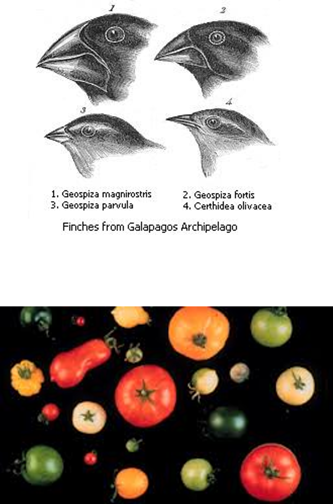
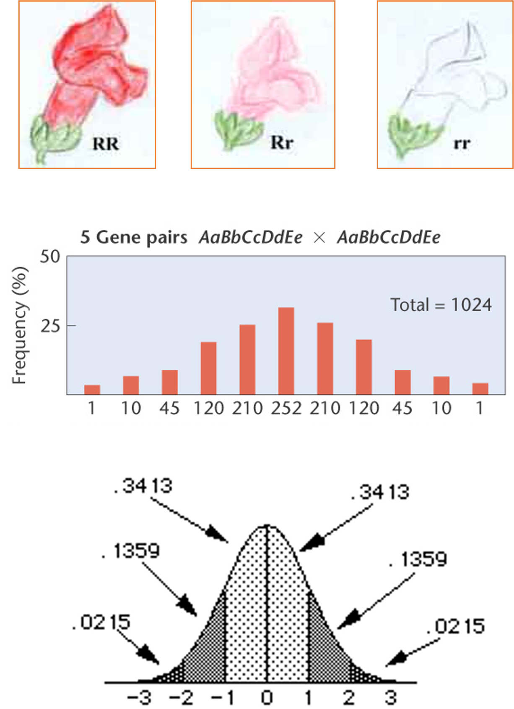
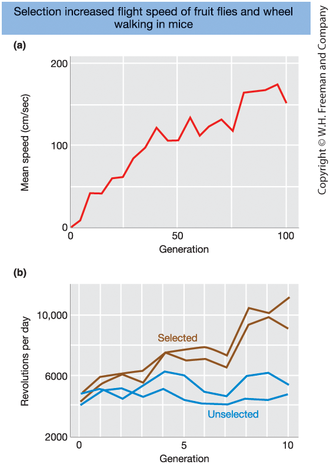

## Learning Goals - Quantitative Genetics

**1. Measuring Quantitative Variation**

- Understand how mathematical models and statistical methods are used to study complex traits  

**2. A Simple Genetic Model**

- Assess the relative contributions of genetic and environmental factors to phenotypic variation  

**3. Heritability**

- Calculate and interpret **broad-sense heritability**  
- Calculate and interpret **narrow-sense heritability**  
- Use parental phenotypes to predict offspring phenotypes  

**4. Mapping Quantitative Traits**

- Explain the principle behind genome-wide association studies


::: notes

In quantitative genetics,
the focus shifts from single-gene traits
to quantitative traits.

These are traits that vary continuously,
such as height,
milk yield,
blood pressure,
or crop yield.

The first step is measuring variation.

Mathematical models
and statistical methods
are used to describe and analyze complex traits.

This is where genetics meets statistics.

Next, a simple genetic model is introduced.

This model separates phenotypic variation
into genetic and environmental components,
and quantifies their contributions.

Then, heritability is considered.

Broad-sense heritability measures
the total genetic contribution to variation.

Narrow-sense heritability focuses on additive effects,
which enable prediction of offspring phenotypes
from parental phenotypes.

Finally,
association mapping is introduced.

These methods test for statistical links
between genetic variants and traits,
helping identify the loci involved.

By the end of this chapter,
key concepts include:
how quantitative traits are analyzed,
how heritability is interpreted,
and how genetic loci can be identified.

:::


## What Is Quantitative Genetics?

::: {.columns}

::: {.column width="50%"}

Quantitative genetics studies complex traits
influenced by many genes and environmental factors.

<br>

It extends Mendelian genetics by focusing on the
combined effects of many genes and the environment.

<br>

Statistical models are central to its analysis.

<br>

A biological discipline with great applied significance for agriculture, human healthcare, and for understanding evolutionary processes.


:::

::: {.column width="50%"}

**Core concepts**

- Definition of a quantitative trait
- Genetic models for quantitative traits
- Genetic parameters (heritability, variance, correlation)
- Statistical and mathematical modeling

<br>

**Relevant for genetic analyses**

- Estimating heritability
- Estimating genetic risk or breeding values from pedigree or genomic data
- Predicting response to selection
- Evaluating consequences of selection

:::

:::

::: notes

<br>

Quantitative genetics is the study of complex traits —
traits influenced by many genes
and environmental factors.

It builds on Mendelian genetics,
but instead of focusing on single genes with large effects,
it considers the combined effects
of many genes acting together.

Because these effects are small and distributed,
statistical models are essential.

Quantitative genetics has major applications:
in agriculture,
in human healthcare,
and in understanding evolutionary change.

The course focuses on four core elements:
definition of quantitative traits,
genetic modeling,
estimation of key parameters such as heritability and genetic correlation,
and statistical analysis of data.

These tools make it possible to estimate heritability,
predict breeding values,
assess genetic risk,
and predict response to selection.

In summary,
quantitative genetics provides a mathematical framework
for understanding and predicting complex trait variation.

:::

## Natural and Artificial Selection

::: {.columns}

::: {.column width="50%"}

Natural selection and selective breeding can both cause changes in animals and plants:

<br>

Natural selection happens naturally.

<br>

Selective breeding occurs when humans intervene => artificial selection. 

<br>

Selective breeding (and natural selection) takes place over many generations. 

:::

::: {.column width="50%"}

{width=50%}

:::

:::

::: notes

This slide contrasts natural and artificial selection.

The top image shows Darwin’s finches.
Different beak shapes evolved because birds with beaks better suited to available food survived and reproduced more successfully.
This is natural selection — the environment determines which traits increase in frequency.

The bottom image shows vegetables with diverse shapes and colors.
This diversity is the result of artificial selection.
Humans choose individuals with desirable traits and breed them intentionally.

In both cases, the underlying mechanism is the same:
individuals with certain heritable traits leave more offspring.

The difference lies in who or what applies the selection pressure —
nature or humans.

Both processes operate over multiple generations
and lead to genetic change in populations.

:::


## What Is Quantitative Genetics?

::: {.columns}

::: {.column width="50%"}

Phenotype (P) is determined by genotype (G) and environment (E):

$$
P = G + E
$$

- Parents transmit a random sample of their genes to offspring  
- Each offspring receives a different genetic combination  

Quantitative genetics asks:

How much of the phenotypic variation
is due to genetic differences?

This leads to the concept of **heritability**.

:::

::: {.column width="50%"}

Why does this matter?

Quantitative genetics allows us to:

- Improve traits through selective breeding  
- Predict genetic risk in human populations  
- Understand how natural selection changes populations  

In all cases, we seek to estimate the effect of genotypes ($G$)
on phenotypes ($P$).

:::

:::

::: notes

Quantitative genetics starts from a simple model:

Phenotype equals genotype plus environment.

Because parents transmit a random sample of their genes,
offspring differ genetically.

These genetic differences
contribute to phenotypic differences.

The central question is:

How much of the observed variation
is due to genetic variation?

This leads to the concept of heritability.

Quantitative genetics is not only theoretical.

In animal and plant breeding,
it is used to improve traits over generations.

In human genetics,
it is used to estimate genetic risk
from genomic information.

In evolutionary biology,
it helps explain how natural selection
changes populations over time.

In all cases,
the key task is to estimate
the effect of genotypes on phenotypes.

:::


## What Are Complex (Quantitative) Traits?

::: {.columns}

::: {.column width="50%"}

**Mendelian traits**

- Discrete phenotypes (e.g., red/white, sick/healthy)
- Simple genotype–phenotype relationship
- Often large gene effects

<br>

**Quantitative traits**

- Many phenotype classes, often continuously distributed
- Influenced by many genes, each with small effects
- Individual gene effects are typically not directly observable
- Often influenced by the environment

:::

::: {.column width="50%"}

{width=65%}

:::

:::


::: notes

This slide distinguishes Mendelian and quantitative traits.

Mendelian traits are simple.

They fall into clear categories,
such as red versus white,
or healthy versus sick.

Usually, a single gene has a large effect,
so the genotype–phenotype relationship is straightforward.

Quantitative traits are different.

They show a continuous range of values,
such as height or milk yield.

They are influenced by many genes,
each with a small effect.

They are also affected by the environment.

So instead of clear categories,
there is a smooth distribution.

The key point is:

Most traits of interest
are controlled by many genes acting together.

:::


## Types of Traits and Inheritance

::: {.columns}

::: {.column width="50%"}

Individuals are described by their phenotype 
(e.g., appearance, performance, or disease status).

<br>

**Continuous traits**

- Infinite range of values (e.g., height)  
- Typically influenced by many genes and the environment  

<br>

**Categorical traits**

- Discrete groups (e.g., purple vs. white flowers)  
- May involve simple or complex inheritance  

:::

::: {.column width="50%"}

**Threshold traits**

- Categorical outcome  
- Underlying liability is quantitative (e.g., type 2 diabetes)  

<br>

**Meristic traits**

- Countable values (e.g., clutch size)  
- Quantitative but not continuous  

:::

:::


::: notes

Quantitative traits come in several forms,
and it is important not to confuse
the type of trait
with the type of inheritance.

Continuous traits can take an infinite range of values.
Height is a classic example.

Categorical traits fall into distinct groups.
Some follow simple Mendelian inheritance,
such as flower color in peas.

Many,
especially diseases,
involve complex inheritance.

Threshold traits are a special case.

The observed outcome is categorical,
but the underlying liability is quantitative.

Disease occurs
when the underlying risk
exceeds a threshold.

Meristic traits are countable traits.

A bird can lay one, two, or three eggs —
but not two and a half.

These traits are discrete,
yet still quantitative.

The key message is this:

Complex traits are defined by complex inheritance,
not by whether the phenotype
is continuous or categorical.

:::


## Measuring Quantitative Variation

::: {.columns}

::: {.column width="50%"}

To study complex traits, we need basic statistical tools:

<br>

- **Mean** describes the average level of a trait  
- **Variance** quantifies variation around the mean  
- **Normal distribution** describes how trait values are distributed  

<br>

These tools allow us to quantify and compare
phenotypic variation.

:::

::: {.column width="50%"}

**Mean**

$$
\bar{x} = \frac{1}{n} \sum_{i=1}^{n} x_i
$$

**Variance**

$$
\mathrm{Var}(X) = \frac{1}{n-1} \sum_{i=1}^{n} (x_i - \bar{x})^2
$$

**Normal distribution**

$$
f(x) = \frac{1}{\sqrt{2\pi\sigma^2}}
\exp\left(-\frac{(x-\mu)^2}{2\sigma^2}\right)
$$

:::

:::


::: notes

To study quantitative traits,
basic statistical tools are required.

First, the mean.

The mean describes the average level
of a trait in a population.

Second, variance.

Variance describes how much individuals differ
around that average.

Two populations may have the same mean,
but very different levels of variability.

Many quantitative traits follow
an approximately normal,
bell-shaped distribution.

This distribution plays a central role
in quantitative genetics,
because it emerges naturally
when many small effects combine.

These simple concepts —
mean, variance, and the normal distribution —
form the foundation
of quantitative genetics.

:::


## The Mean

::: {.columns}

::: {.column width="50%"}

When studying quantitative traits, we usually sample from a population.

<br>

Sample mean:

$$
\bar{X} = \frac{1}{n} \sum_{i=1}^{n} X_i
$$

<br>

Population mean:

$$
\mu
$$

The mean describes the **center** of the data.

:::

::: {.column width="50%"}

**Example**

Height (cm) for 5 individuals:  
168, 172, 170, 174, 166

<br>

$$
\bar{X} = \frac{168 + 172 + 170 + 174 + 166}{5}
$$

<br>

$$
\bar{X} = \frac{850}{5} = 170
$$

We use $\bar{X}$ to estimate the true population mean $\mu$.

:::

:::

::: notes

When studying quantitative traits,
the entire population is usually not observed.

Instead, a random sample is used.

If the sample is random,
it provides an unbiased estimate
of population parameters.

The sample mean is calculated
by adding all observed values
and dividing by the number of observations.

The sample mean is denoted by X-bar,
and the population mean by mu.

Because traits such as height vary among individuals,
the phenotype is a random variable.

Sampling therefore introduces variation due to chance.

On the left,
the formal definition of the sample mean is shown.

On the right,
a simple example is computed.

The same calculation applies
regardless of sample size.

The key idea is this:

The sample mean is the best estimate
of the unknown population mean.

:::


## The Variance

::: {.columns}

::: {.column width="50%"}

Variance describes the spread of the data.

Deviation from the mean:

$$
d_i = X_i - \bar{X}
$$

Population variance:

$$
\sigma^2 = \frac{\sum (X_i - \mu)^2}{n}
$$

Standard deviation:

$$
\sigma = \sqrt{\sigma^2}
$$

:::

::: {.column width="50%"}

**Example**

Using the sample: 168, 172, 170, 174, 166  

Mean:
$$
\bar{X} = 170
$$

Deviations: -2, 2, 0, 4, -4  

Squared deviations: 4, 4, 0, 16, 16  (sum = 40)

Variance (n = 5):
$$
\sigma^2 = \frac{40}{5} = 8
$$

Standard deviation:
$$
\sigma = \sqrt{8} \approx 2.83 \text{ cm}
$$
:::

:::

::: notes

The mean describes the center of the data,
but not how spread out the values are.

Variance measures the spread.

It is the average squared deviation from the mean.

Deviations are defined
as each observation minus the mean.

Because positive and negative deviations cancel,
they are squared before averaging.

The standard deviation
is the square root of the variance,
which returns the units to the original scale.

On the right,
the calculation is shown for a simple example.

The key idea is this:

Variance and standard deviation
describe how much individuals differ from the mean.

This becomes central in quantitative genetics,
when phenotypic variance is partitioned
into genetic and environmental components.

:::


## The Normal Distribution

::: {.columns}

::: {.column width="50%"}

Many biological traits follow an approximately **normal distribution**.

A normal distribution is fully determined by:

- Mean: $\mu$  
- Variance: $\sigma^2$  
  (or standard deviation $\sigma$)

<br>

Probability density function:

$$
f(x) = \frac{1}{\sigma \sqrt{2\pi}} 
\exp\left( -\frac{(x - \mu)^2}{2\sigma^2} \right)
$$

:::

::: {.column width="50%"}

**Key Properties**

- Bell-shaped curve  
- Symmetric around the mean $\mu$  
- Spread determined by the standard deviation $\sigma$  
- Total area under the curve equals 1  

<br>

**Central role in quantitative genetics**

- Describing quantitative traits  
- Modeling phenotypic variation  
- Partitioning genetic and environmental variance  

:::

:::

::: notes

Many biological traits follow
an approximately normal,
or bell-shaped, distribution.

A normal distribution is determined
by two parameters:

The mean,
which sets the center,

and the variance,
which determines the spread.

The curve is symmetric around the mean.

Values close to the mean
are more common,
while extreme values are rare.

Changing the mean
shifts the distribution left or right.

Changing the variance
changes how spread out the values are.

The total area under the curve equals one,
because it represents total probability.

This distribution plays a central role
in quantitative genetics.

It is used to describe trait variation
and to partition phenotypic variance
into genetic and environmental components.

:::


## Normal Distribution (Effect of μ and σ)


```{r}
library(ggplot2)

params <- data.frame(
  mu = c(0, 0, 1),
  sigma = c(1, 2, 1),
  label = c("μ = 0, σ = 1",
            "μ = 0, σ = 2",
            "μ = 1, σ = 1")
)

x <- seq(-6, 6, length.out = 600)

df <- do.call(rbind, lapply(1:nrow(params), function(i) {
  mu <- params$mu[i]
  sigma <- params$sigma[i]
  data.frame(
    x = x,
    fx = dnorm(x, mean = mu, sd = sigma),
    mu = mu,
    label = params$label[i]
  )
}))

ggplot(df, aes(x, fx, color = label)) +
  geom_line(linewidth = 1.3) +
  geom_vline(aes(xintercept = mu, color = label),
             linetype = "dashed",
             linewidth = 1, show.legend=FALSE) +
  labs(
    x = "x",
    y = "Density",
    color = NULL
  ) +
  theme_minimal(base_size = 18) +
  theme(
    legend.position = "right",
    legend.text = element_text(size = 14)
  )
```

::: notes

Here are three normal distributions.

The dashed vertical lines mark the mean of each distribution.

First, focus on the two curves
with the same mean, μ equals zero.

The only difference is the standard deviation.

When σ increases,
the distribution becomes wider and flatter.

When σ decreases,
it becomes narrower and taller.

Changing σ affects the spread,
but not the location of the mean.

Now consider the curve
where μ equals one.

Here, the spread is the same,
but the entire distribution is shifted to the right.

Changing μ shifts the center,
while changing σ changes the spread.

In all cases,
the total area under the curve equals one.

In quantitative genetics,
many traits follow this type of distribution.

Partitioning phenotypic variance
means partitioning σ²,
the variance of this distribution.

:::


## A Simple Genetic Model for Quantitative Traits

::: {.columns}

::: {.column width="50%"}

**Model**

A quantitative trait can be expressed as:

$$
P = \mu + G + E
$$

- $\mu$ = population mean  
- $G$ = genetic deviation  
- $E$ = environmental deviation  

<br>

Deviation from the mean:

$$
p = P - \mu = G + E
$$

:::

::: {.column width="50%"}

**Interpretation**

Differences between individuals arise from:

- Genetic effects  
- Environmental effects  
- Or both  

<br>

**This model underlies:**

- Variance partitioning  
- Heritability  
- Prediction of response to selection  

:::

:::

::: notes

This is the fundamental model
of quantitative genetics.

The phenotype equals
the population mean
plus a genetic deviation
plus an environmental deviation.

Individuals differ from the mean
because of genetic effects,
environmental effects,
or both.

It is often useful to subtract the mean
and work with deviations,
so that p equals G plus E.

This focuses on
what causes individuals to differ.

The genetic component reflects
how genotype shifts the phenotype.

The environmental component reflects
all non-genetic influences.

This simple equation
is the foundation of quantitative genetics.

It underlies variance partitioning,
heritability,
and prediction of response to selection.

:::


## Illustrative Example: Decomposing a Phenotype

::: {.columns}

::: {.column width="50%"}

**Step 1: Observed phenotype**

- Yao Ming’s height:  \( P = 229 \) cm  
- Population mean:  \( \mu = 170 \) cm  

<br>

**Step 2: Deviation from the mean**

$$
p = P - \mu
$$

$$
p = 229 - 170 = 59 \text{ cm}
$$

He is **59 cm taller than average**.

:::

::: {.column width="50%"}

**Step 3: Interpret using the genetic model**

Recall:

$$
p = G + E
$$

Therefore:

$$
59 = G + E
$$

The deviation must arise from:

- Genetic effects ($G$)  
- Environmental effects ($E$)  
- Or both  

We observe only the total deviation — not its separate components.


:::

:::

::: notes

This slide applies the genetic model
to a concrete example.

Yao Ming is 229 cm tall.

If the population mean is 170 cm,
the deviation is:

p = 229 − 170 = 59 cm.

According to the model:

p equals G plus E.

So this deviation must arise
from genetic effects,
environmental effects,
or both.

The individual components G and E
cannot be observed directly.

Only the total phenotype is observed.

The purpose of the model
is not to separate G and E for individuals,
but to analyze variation in populations.

This decomposition leads directly
to variance partitioning
and heritability.

:::


## Modes of Gene Action at One Locus

::: {.columns}

::: {.column width="50%"}

```{r fig.height=9}

library(ggplot2)

# Data
df <- data.frame(
  genotype = rep(c("bb", "Bb", "BB"), 3),
  value = c(
    1, 2, 3,
    1, 3, 3,
    1, 2.5, 3
  ),
  model = rep(c("Additive",
                "Dominant",
                "Partial dominance"), each = 3)
)

df$genotype <- factor(df$genotype, levels = c("bb", "Bb", "BB"))

ggplot(df, aes(x = genotype, y = value, group = 1)) +
  geom_point(size = 5) +
  geom_line(linewidth = 1.3) +
  facet_wrap(~ model, ncol = 1) +
  labs(
    x = "Genotype at locus B",
    y = "Trait value"
  ) +
  theme_minimal(base_size = 26) +
  theme(
    axis.text = element_text(size = 22),
    axis.title = element_text(size = 26),
    strip.text = element_text(size = 24, face = "bold")
  )
```
:::

::: {.column width="50%"}

**Why this matters**

Additive gene action:

- Allele effects add linearly
- Produces predictable transmission
- Creates additive variance ($V_A$)

Dominance:

- Depends on allele combinations
- Does not transmit predictably
- Contributes to $V_D$, not $V_A$

Key insight:

Only additive effects contribute to
**narrow-sense heritability**

:::

:::

::: notes

This figure illustrates three modes of gene action
at a single locus.

On the x-axis are the genotypes:
bb, Bb, and BB.

On the y-axis is the trait value.

In the top panel,
there is additive gene action.

The heterozygote lies exactly between the two homozygotes.

Each allele contributes a fixed amount,
and the effects add linearly.

In the middle panel,
there is dominance.

The heterozygote has the same phenotype
as one of the homozygotes.

The effect depends on allele combinations,
not simple addition.

In the bottom panel,
there is partial dominance.

The heterozygote is intermediate,
but not exactly halfway.

The key idea is this:

Only additive effects
are transmitted predictably from parents to offspring.

Dominance effects depend on allele combinations
and are reshuffled each generation.

Therefore,
additive variance
determines narrow-sense heritability
and response to selection.

:::

## Genotype by Genotype Interaction (Epistasis)
::: {.columns}
::: {.column width="50%"}

```{r fig.height=9}

library(ggplot2)

# Simulate Epistasis Data
df_gg <- rbind(
  data.frame(panel = "No Interaction (Additive)",
             locus1 = rep(c("aa", "AA"), each = 2),
             locus2 = rep(c("bb", "BB"), times = 2),
             value = c(4, 6, 6, 8)),     # Parallel: A adds +2 regardless of B
  data.frame(panel = "G×G Interaction (Epistasis)",
             locus1 = rep(c("aa", "AA"), each = 2),
             locus2 = rep(c("bb", "BB"), times = 2),
             value = c(4, 4, 4, 10))      # Interaction: A only has effect if B is present
)

df_gg$locus2 <- factor(df_gg$locus2, levels = c("bb", "BB"))
df_gg$panel <- factor(df_gg$panel, levels = c("No Interaction (Additive)", "G×G Interaction (Epistasis)"))

ggplot(df_gg, aes(x = locus2, y = value, group = locus1, color = locus1)) +
  geom_line(linewidth = 2) +
  geom_point(size = 5) +
  facet_wrap(~ panel, ncol = 1) +
  scale_color_manual(values = c("aa" = "grey60", "AA" = "steelblue")) +
  labs(x = "Genotype at Locus 2", y = "Trait Value", color = "Locus 1") +
  theme_minimal(base_size = 22) +
  theme(
    strip.text = element_text(face = "bold", size = 20),
    legend.position = "bottom"
  )
```

:::
::: {.column width="50%"}
**Interaction between Locus 1 and Locus 2**

**No Interaction (Additive)**

- **Parallel lines:** The lines do not cross or diverge.
- The effect of **$AA$** is the same regardless of whether the background is **$bb$** or **$BB$**.
- Genetic effects at different loci simply add up linearly.

**G$\times$G Interaction (Epistasis)**

- **Non-parallel lines:** Lines cross or show different slopes.
- The effect of **$AA$** depends on the genotype at **Locus 2**.
- *Example:* **$AA$** only increases the trait value if the individual also carries **$BB$**.

**Key Idea:**  
The phenotypic expression of one gene is modified by the presence of another gene.

:::
:::

::: notes

This figure illustrates gene-by-gene interaction,
also called epistasis.

In the top panel,
there is no interaction.

The lines are parallel.

The effect of locus 1
is the same regardless of locus 2.

Genetic effects simply add up.

In the bottom panel,
there is epistasis.

The lines are not parallel.

The effect of one gene
depends on the genotype at another gene.

For example,
the AA genotype only increases the trait
when combined with BB at the second locus.

The key idea is this:

The effect of a gene
can depend on the genetic background.

In quantitative genetics,
this complicates modeling,
because allele effects are not fixed.

Additive variance remains the main driver of selection,
but epistasis contributes to total genetic variation.

:::


## Genotype × Environment Interaction

::: {.columns}

::: {.column width="50%"}

```{r fig.height=9}

library(ggplot2)

df <- rbind(
  data.frame(panel = "No interaction",
             genotype = rep(c("IL1","IL2"), each = 2),
             env = rep(c("E1","E2"), times = 2),
             value = c(6, 7, 5, 6)),     # parallel: IL1 always +1
  data.frame(panel = "G×E interaction",
             genotype = rep(c("IL1","IL2"), each = 2),
             env = rep(c("E1","E2"), times = 2),
             value = c(7, 5, 5, 7))      # crossing lines
)

df$env <- factor(df$env, levels = c("E1","E2"))
df$panel <- factor(df$panel, levels = c("No interaction", "G×E interaction"))

ggplot(df, aes(env, value, group = genotype)) +
  geom_line(linewidth = 1.2) +
  geom_point(size = 3) +
  facet_wrap(~ panel, ncol = 1) +
  labs(x = "Environment", y = "Trait value") +
  theme_minimal(base_size = 26) +
  theme(
    axis.text = element_text(size = 22),
    axis.title = element_text(size = 26),
    strip.text = element_text(size = 24, face = "bold")
  )
```  

:::

::: {.column width="50%"}


**No interaction**

- Parallel lines  
- Genotype difference is constant across environments  

**G×E interaction**

- Lines cross (or diverge)  
- Genotype ranking depends on environment  

**Key idea:**  
Genotype performance can be environment-dependent.

:::

:::

::: notes

This figure shows reaction norms,
how genotypes perform across environments.

In the top panel,
there is no genotype-by-environment interaction.

The lines are parallel.

The difference between genotypes
is constant across environments.

In the bottom panel,
there is genotype-by-environment interaction.

The lines cross.

The performance of the genotypes
depends on the environment.

A genotype that performs best in one environment
may perform worse in another.

This is the key idea:

Genetic effects can depend on the environment.

This matters because selection in one environment
may not give the best genotype in another.

In such cases,
the model is extended
to include a genotype-by-environment interaction term.

:::


## From Phenotype to Variance

::: {.columns}

::: {.column width="50%"}

**Start with the model**

$$
P = \mu + G + E
$$

Phenotypic variance:

$$
V_P = \mathrm{Var}(P)
$$

Since $\mu$ is constant:

$$
V_P = \mathrm{Var}(G + E)
$$

Basic statistical rule:

$$
V_P = V_G + V_E + 2\mathrm{Cov}(G,E)
$$

:::

::: {.column width="50%"}

**If genetic and environmental effects are independent**

$$
\mathrm{Cov}(G,E) = 0
$$

Then:

$$
V_P = V_G + V_E
$$

Meaning:

<br>

Total variation  = genetic variation  + environmental variation  

<br>

This is the foundation of heritability.

:::

:::

::: notes

Start with the phenotype model:

P equals μ plus G plus E.

Phenotypic variance measures
how much individuals differ from the mean.

Because μ is constant,
it does not contribute to variance.

So the variance of P
becomes the variance of G plus E.

A basic rule states:

The variance of a sum
equals the sum of the variances
plus twice the covariance.

If genetic and environmental effects
are independent,
the covariance is zero.

In that case:

Total phenotypic variation
equals genetic variation
plus environmental variation.

This relationship
is the foundation of heritability.

:::


## Visualizing Variance Partitioning

```{r}
library(ggplot2)

# 1. Data Preparation
data <- data.frame(
  component = factor(c("VG", "VE"), levels = c("VE", "VG")), 
  value = c(60, 40),
  label = c("V[E]", "V[G]"),
  color_group = c("Env", "Gen")
)

# 2. Create the Plot
ggplot(data, aes(x = 1, y = value, fill = color_group)) +
  # Main Stacked Bar
  geom_col(width = 0.4, color = "white", linewidth = 1.5) +
  
  # Internal Labels (VG and VE)
  geom_text(aes(label = label),
            position = position_stack(vjust = 0.5),
            size = 10, 
            parse = TRUE,
            fontface = "bold",
            color = "white") +
  
  # External Brackets and Total (VP)
  # Vertical line for the bracket
  annotate("segment", x = 1.3, xend = 1.3, y = 0, yend = 100, 
           linewidth = 1.5, color = "grey30") +
  # Small horizontal "ticks" for the bracket
  annotate("segment", x = 1.28, xend = 1.32, y = 0, yend = 0, linewidth = 1.5, color = "grey30") +
  annotate("segment", x = 1.28, xend = 1.32, y = 100, yend = 100, linewidth = 1.5, color = "grey30") +
  # The VP Label
  annotate("text", x = 1.4, y = 50, label = "V[P]", 
           parse = TRUE, size = 12, hjust = 0, fontface = "bold", color = "grey20") +
  
  # Professional Colors
  scale_fill_manual(values = c("Gen" = "steelblue", "Env" = "grey60")) +
  
  # Titles and Scales
  labs(
    title = expression(bold(The~Simple~Genetic~Model)),
    subtitle = expression(V[P] == V[G] + V[E]),
    x = NULL,
    y = "Total Phenotypic Variation (%)"
  ) +
  
  # VITAL: Expand the right side to prevent clipping
  coord_cartesian(xlim = c(0.5, 1.8)) + 
  
  # Theme cleanup
  theme_minimal(base_size = 20) +
  theme(
    axis.text.x = element_blank(),
    axis.title.y = element_text(face = "bold", size = 18),
    plot.title = element_text(hjust = 0.5, face = "bold", size = 24),
    plot.subtitle = element_text(hjust = 0.5, size = 20, color = "grey30"),
    panel.grid = element_blank(),
    legend.position = "none",
    plot.margin = margin(10, 10, 10, 10)
  ) +
  scale_y_continuous(breaks = seq(0, 100, 25))

```

::: notes

This figure shows total phenotypic variance
as a single bar.

That total variance
can be partitioned into two components:

a genetic component
and an environmental component.

In this example,
genetic variance accounts for 40 percent,
and environmental variance for 60 percent.

The exact values are not important.

The key idea is:

Phenotypic variation can be decomposed
into genetic and environmental components.

This provides the basis for heritability,
which is the proportion of total variance
that is genetic.

:::


## Example: Partitioning Variance (Maize Experiment I)

::: {.columns}

::: {.column width="50%"}

**Numerical results**

Total phenotypic variance:

$$
V_P = 14.67
$$

Genetic variance  
(variation among inbred line means):

$$
V_G = 12.00
$$

Environmental variance  
(variation among environments):

$$
V_E = 2.67
$$

Check:

$$
V_P = V_G + V_E = 12.00 + 2.67 = 14.67
$$

:::

::: {.column width="50%"}

**Interpretation**

- Most variation is genetic  
  (12.00 of 14.67)

- Environmental variation is smaller  
  (2.67)

- The decomposition holds because:

  $$
  \mathrm{Cov}(G,E) = 0
  $$

- Genotypes were randomized  
  across environments  

This illustrates that variance components add when genotype and environment are independent.

:::

:::


::: notes

This slide applies variance decomposition
to real data.

In this experiment,
inbred maize lines were grown
across different environments.

The total phenotypic variance is 14.67.

This is partitioned into:

genetic variance,
12.00,

and environmental variance,
2.67.

These components add exactly
to the total variance.

This works because
genetic and environmental effects
are independent.

Genotypes were randomized across environments,
so the covariance is zero.

The key idea is:

Phenotypic variance can be decomposed
into genetic and environmental components.

This leads directly
to heritability,
which is defined as a ratio
of these components.

:::


## Covariance and Correlation in Quantitative Genetics

::: {.columns}

::: {.column width="50%"}

**Covariance: The Core Quantity**

Covariance measures whether two variables
vary together:

$$
\mathrm{Cov}(X,Y)
$$

It appears everywhere in Quantitative Genetics:

- Phenotypic variance  
- Genetic variance  
- Genetic covariance between traits  
- Response to selection  

Variance is simply:

$$
\mathrm{Var}(X) = \mathrm{Cov}(X,X)
$$

:::

::: {.column width="50%"}

**Standardized Form: Correlation**

Correlation rescales covariance:

$$
r = \frac{\mathrm{Cov}(X,Y)}{\sigma_X \sigma_Y}
$$

- Unitless  
- Bounded between −1 and 1  
- Measures strength of linear association  

In the variance model:

$$
V_P = V_G + V_E + 2\mathrm{Cov}(G,E)
$$

If Cov(G,E) = 0, variance components add cleanly.

:::

:::

::: notes

Covariance measures
whether two variables vary together.

In quantitative genetics,
this concept is fundamental.

Even variance
is a special case of covariance,
the covariance of a variable with itself.

When phenotypic variance is decomposed,
it equals genetic variance
plus environmental variance
plus twice the covariance
between genetic and environmental effects.

If genotype and environment are independent,
the covariance is zero,
and the variance partitions cleanly.

If they are correlated,
the covariance term remains,
and the components cannot be separated cleanly.

In this sense,
quantitative genetics is largely the study
of variances and covariances.

:::


## Visualizing Correlation

```{r}
library(ggplot2)
library(MASS)

set.seed(123)

n <- 1000

mu <- c(170, 170)
sd <- 7

# Perfect correlation
Sigma_perfect <- matrix(c(sd^2, sd^2,
                          sd^2, sd^2), 2, 2)

data_perfect <- mvrnorm(n, mu, Sigma_perfect)

# Strong positive correlation (r = 0.8)
r <- 0.8
Sigma_strong <- matrix(c(sd^2, r*sd^2,
                         r*sd^2, sd^2), 2, 2)

data_strong <- mvrnorm(n, mu, Sigma_strong)

# No correlation
Sigma_none <- matrix(c(sd^2, 0,
                       0, sd^2), 2, 2)

data_none <- mvrnorm(n, mu, Sigma_none)

# Combine
df <- rbind(
  data.frame(twin1 = data_perfect[,1],
             twin2 = data_perfect[,2],
             type = "Perfect correlation"),
  data.frame(twin1 = data_strong[,1],
             twin2 = data_strong[,2],
             type = "Strong positive correlation"),
  data.frame(twin1 = data_none[,1],
             twin2 = data_none[,2],
             type = "No correlation")
)

df$type <- factor(df$type,
                  levels = c("Perfect correlation",
                             "Strong positive correlation",
                             "No correlation"))

lims <- range(c(df$twin1, df$twin2))

ggplot(df, aes(twin1, twin2)) +
  geom_point(alpha = 0.6) +
  geom_smooth(method = "lm", se = FALSE, color = "red") +
  facet_wrap(~ type) +
  coord_fixed(xlim = lims, ylim = lims) +
  labs(
    x = "Twin 1 height (cm)",
    y = "Twin 2 height (cm)"
  ) +
  theme_minimal(base_size = 16)
```

::: notes

This figure visualizes correlation
between two variables.

Each point represents a pair of observations,
here shown as twin heights.

In the top panel,
there is perfect correlation.

All points lie exactly on a straight line.

Knowing one value
completely determines the other.

In the middle panel,
there is strong positive correlation.

The points follow a clear upward trend,
but with some scatter.

As one variable increases,
the other tends to increase.

In the bottom panel,
there is no correlation.

The points are scattered randomly.

Knowing one value
gives no information about the other.

The key idea is this:

Correlation measures
the strength of a linear relationship
between two variables.

:::


## Broad-Sense Heritability ($H^2$)

::: {.columns}

::: {.column width="50%"}

**Definition**

Key question:

- How much of the observed *variation* is genetic?

Broad-sense heritability:

$$
H^2 = \frac{V_G}{V_P}
$$

where:

- $V_G$ = genetic variance  
- $V_P$ = total phenotypic variance  

Range:

- $0 \le H^2 \le 1$

:::

::: {.column width="50%"}

**Interpretation**

- $H^2 = 0$ → all variation is environmental  
- $H^2 = 1$ → all variation is genetic  

Important:

- Describes **variation in a population**
- Not the “% genetic” of an individual
- Population- and environment-specific

“Broad-sense” includes:

- Additive effects  
- Dominance effects  
- Gene–gene interactions (epistasis)

:::

:::

::: notes

Broad-sense heritability answers a key question:

How much of the variation in a population
is associated with genetic differences?

It is defined as
genetic variance divided by total phenotypic variance.

Its value ranges from zero to one.

If broad sense heritability equals zero,
all variation is environmental.

If broad sense heritability equals one,
all variation is genetic.

But this does not apply to individuals.

Heritability always describes
variation within a population.

If all individuals had identical genotypes,
genetic variance would be zero,
even though genes still affect the trait.

Broad-sense heritability includes
all genetic effects:

additive,
dominance,
and interaction effects.

Heritability is not a fixed property.

It depends on the population,
the environment,
and the amount of genetic variation present.

:::


## Heritability Depends on the Environment (Maize Example)

::: {.columns}

::: {.column width="50%"}

**Experiment I: Similar Environments**

- $V_G = 12.0$
- $V_E = 2.67$
- $V_P = 14.67$

$$
H^2 = \frac{12.0}{14.67} = 0.82
$$

Interpretation:

- 82% of the observed variation is genetic  
- Trait appears highly heritable  

:::

::: {.column width="50%"}

**Experiment II: More Variable Environments**

- $V_G = 12.0$
- $V_E = 24.0$
- $V_P = 36.0$

$$
H^2 = \frac{12.0}{36.0} = 0.33
$$

Interpretation:

- 33% of the observed variation is genetic  
- Environmental variation dominates  

:::

:::

::: notes

This slide compares two experiments
using the same maize lines.

Importantly,
genetic variance is identical in both cases.

In Experiment I,
environmental variance is small.

Most of the total variation is genetic,
and heritability is high.

In Experiment II,
environmental variance is much larger.

Total variation increases,
and heritability drops substantially.

Even though the genetics did not change,
heritability changes.

This illustrates a key concept:

Heritability is not a fixed property of a trait.

It depends on the balance
between genetic and environmental variation.

If environmental variance increases,
heritability decreases.

If environmental variance decreases,
heritability increases.

This does not mean genes are less important.

It means their contribution
to observed variation has changed.

:::


## Estimating Heritability Using Identical Twins

::: {.columns}

::: {.column width="50%"}

**Theory**

Identical (monozygotic) twins:

- Share 100% of their genes  
- If reared apart → environments treated as independent  

Under independence:

$$
\mathrm{Cov}(\text{Twin 1}, \text{Twin 2}) = V_G
$$

Therefore:

$$
H^2 = \frac{V_G}{V_P}
     = \frac{\mathrm{Cov}(\text{twins})}{V_P}
$$

Key assumption:

$$
\mathrm{Cov}(G,E) = 0
$$

:::

::: {.column width="50%"}

**Example: IQ in Twins Reared Apart**

From data:

- Covariance between twins = 119.2  
- Total phenotypic variance $V_P$ = 154.3  

Heritability estimate:

$$
H^2 = \frac{119.2}{154.3} = 0.77
$$

**Interpretation**

- 77% of IQ variation (in this population)  
  is associated with genetic differences  

- Refers to population variation  
  — not individuals

:::

:::


::: notes

Identical twins share the same genotype.

If they are reared apart,
their environments can be treated as independent.

Under this assumption,
the covariance between twin phenotypes
reflects genetic variance.

So covariance between twins
equals V_G.

Broad-sense heritability
can therefore be estimated as:

covariance between twins
divided by total phenotypic variance.

In this example,
the covariance is 119.2,
and total variance is 154.3.

This gives broad sense heritability equal to 0.77.

Interpretation is important:

This does not apply to individuals.

It means that 77 percent of the variation in IQ
in this population
is associated with genetic differences.

Twin studies rely on key assumptions:

independent environments,
no strong gene–environment correlation,
and accurate measurement.

:::


## Broad-Sense Heritability in Humans  

::: {.columns}

::: {.column width="50%"}

<div style="font-size: 0.7em">

| Trait | $H^2$ |
|-------|-------|
| **Physical traits** | |
| Height | 0.88 |
| Fingerprint ridge count | 0.97 |
| Systolic blood pressure | 0.64 |
| **Cognitive traits** | |
| IQ | 0.69 |
| Spatial processing speed | 0.36 |
| **Personality traits** | |
| Extraversion | 0.54 |
| Neuroticism | 0.48 |
| **Psychiatric disorders** | |
| Autism | 0.90 |
| Schizophrenia | 0.80 |
| Major depression | 0.37 |
| **Beliefs / attitudes** | |
| Religiosity (adults) | 0.30–0.45 |
| Conservatism (adults) | 0.45–0.65 |

</div>

:::

::: {.column width="50%"}

This table shows broad-sense heritability ($H^2$) estimates from twin studies.

$$
H^2 = \frac{V_G}{V_P}
$$

**Key patterns:**

- Physical traits → often high $H^2$  
  (e.g., height, fingerprints)

- Cognitive & personality traits → moderate $H^2$

- Psychiatric disorders → variable  
  (some high, some moderate)

- Even beliefs and attitudes show measurable heritability

:::

:::

::: notes

This table shows broad-sense heritability estimates from twin studies.

Recall:
broad sense heritability equals genetic variance divided by total phenotypic variance.

These values describe how much variation in a population
is associated with genetic differences.

Several patterns emerge.

Physical traits often show high heritability,
such as height and fingerprint patterns.

Cognitive and personality traits
tend to show moderate heritability.

Psychiatric disorders vary,
with some showing high values
and others more moderate.

Even beliefs and attitudes
can show measurable heritability.

The key interpretation is critical:

High heritability does not mean
a trait is genetically determined,
or that it cannot change.

Heritability is always
population-specific
and environment-specific.

It measures variation —
not destiny.

:::


## Narrow-Sense Heritability: Predicting Phenotypes

::: {.columns}

::: {.column width="50%"}

**From Broad to Narrow Heritability**

Broad-sense heritability:

$$
H^2 = \frac{V_G}{V_P}
$$

But genetic variance contains multiple components:

- **Additive variance ($V_A$)**  
  → predictably transmitted  

- **Dominance variance ($V_D$)**  
  → depends on allele combinations  

Total genetic variance:

$$
V_G = V_A + V_D + V_I
$$

where $V_I$ = interaction (epistatic) variance

:::

::: {.column width="50%"}

**Narrow-Sense Heritability**

$$
h^2 = \frac{V_A}{V_P}
$$

Focuses only on **additive variance**.

Why?

- Additive effects are predictably inherited  
- Determine parent–offspring resemblance  
- Determine response to selection  

Key idea:

Additive genetic variation drives response to selection.

:::

:::

::: notes

Broad-sense heritability includes all genetic variance.

But genetic variance has different components.

Additive variance reflects the average effect of alleles.

Dominance and interaction variance depend on specific allele combinations.

Because allele combinations are reshuffled each generation,
these components are not transmitted predictably.

Only additive effects are passed on in a consistent way.

Narrow-sense heritability focuses on this component:

narrow sense heritability equals additive variance divided by total phenotypic variance.

This is the key quantity for prediction.

It determines resemblance between relatives
and response to selection.

If narrow sense heritability is high, selection is effective.

If narrow sense heritability is low, response is limited.

The key distinction is simple:

Broad-sense heritability describes total genetic influence,
while narrow-sense heritability captures what can be inherited predictably.

:::


## Narrow-Sense Heritability ($h^2$)

::: {.columns}

::: {.column width="50%"}

**Definition**

$$
h^2 = \frac{V_A}{V_P}
$$

- $V_A$ = additive genetic variance  
- $V_P$ = total phenotypic variance  

Only additive variance is predictably transmitted.

Broad-sense heritability:

$$
H^2 = \frac{V_G}{V_P}
$$

But:

$$
V_G = V_A + V_D + V_I
$$

:::

::: {.column width="50%"}

**Estimation**

Parent–offspring covariance:

$$
\mathrm{Cov}_{\text{parent, offspring}} = \frac{1}{2} V_A
$$

Therefore:

$$
h^2 = \frac{2\,\mathrm{Cov}_{\text{parent, offspring}}}{V_P}
$$

Half-sibs share $\frac{1}{4}$ of additive effects:

$$
V_A = 4\,\mathrm{Cov}_{\text{half-sibs}}
$$

Example:

Human height: $h^2 \approx 0.8$

:::

:::

::: notes

Left panel:

Narrow-sense heritability focuses on additive genetic variance.

Broad-sense heritability includes all genetic effects,
including dominance and interactions.

But only additive effects are transmitted predictably
from parents to offspring.

That is why narrow-sense heritability
focuses on V_A.

Right panel:

An offspring inherits half its alleles from each parent.

Because additive effects sum across alleles,
the covariance between parent and offspring
equals one-half of the additive variance.

Rearranging gives:

Narrow-sense heritability equals
two times the covariance between parent and offspring,
divided by total phenotypic variance.

Similarly, half-siblings share one-quarter
of their additive effects.

So additive variance can be estimated as
four times the covariance between half-sibs.

For example, human height has high narrow-sense heritability,
around 0.8.

This means most of the variation in height
within a population
is associated with additive genetic differences.

But this does not mean height is genetically fixed.

Environmental effects still contribute
to differences between individuals.

:::


## Narrow-Sense Heritability (h²)

::: {.columns}

::: {.column width="50%"}

```{r fig.height=9}
library(ggplot2)
set.seed(123)
n <- 500; h2_true <- 0.8
mother <- rnorm(n, 170, 7); father <- rnorm(n, 175, 7)
daughter <- 170 + h2_true * (mother - 170) + rnorm(n, 0, 7 * sqrt(1 - h2_true))
son <- 175 + h2_true * (father - 175) + rnorm(n, 0, 7 * sqrt(1 - h2_true))
df <- rbind(data.frame(parent = mother, offspring = daughter, pair = "Mother–Daughter"),
            data.frame(parent = father, offspring = son, pair = "Father–Son"))

ggplot(df, aes(parent, offspring)) +
  geom_point(alpha = 0.3, color = "steelblue", size = 2.5) +
  geom_smooth(method = "lm", se = FALSE, color = "firebrick", linewidth = 2) +
  geom_abline(slope = 1, intercept = 0, linetype = "dotted", color = "grey40", linewidth = 1) +
  facet_wrap(~ pair, ncol = 1) +
  theme_minimal(base_size = 18) +
  labs(x = "Parent Height (cm)", y = "Offspring Height (cm)") +
  theme(strip.text = element_text(face = "bold", size = 20))

```  

:::

::: {.column width="50%"}

**Parent–Offspring Regression for Height**

- Each point = one parent–offspring pair  
- Clear positive relationship  
- Slope of regression line ≈ $h^2$

Interpretation:

The steeper the slope,
the greater the additive genetic contribution to variation.
:::

:::

::: notes

This figure shows parent–offspring regressions for height.

In the top panel are mother–daughter pairs.
In the bottom panel are father–son pairs.

Each point represents one parent–offspring pair.

There is a clear positive relationship:
taller parents tend to have taller offspring.

The red line is the regression line.

Its slope estimates narrow-sense heritability.

Why?

Because additive genetic effects are transmitted predictably
from parents to offspring.

If additive genetic variance is large,
offspring closely resemble their parents,
and the slope is steep.

If additive genetic variance is small,
the resemblance is weaker,
and the slope is flatter.

In this example, the slope is close to 0.8,
indicating a strong additive genetic contribution to variation in height.

But this describes variation in a population,
not how genetic height is for an individual.

Environmental effects still contribute to differences between individuals.

:::


## Narrow-Sense Heritability (h²) Across Species

::: {.columns}

::: {.column width="50%"}

<div style="font-size: 1em">

| Trait | h² (%) |
|-------------------------------|--------|
| **Agronomic species** | |
| Body weight (cattle) | 65 |
| Milk yield (cattle) | 35 |
| Back-fat thickness (pig) | 70 |
| Litter size (pig) | 5 |
| Body weight (chicken) | 55 |
| Egg weight (chicken) | 50 |
| **Natural species** | |
| Bill length (Darwin’s finch) | 65 |
| Flight duration (milkweed bug) | 20 |
| Plant height (jewelweed) | 8 |
| Fecundity (red deer) | 46 |
| Life span (collared flycatcher) | 15 |

</div>

:::

::: {.column width="50%"}

These are estimates of **narrow-sense heritability (h²)** in different species and traits.

$$h^2 = V_A / V_P$$  

- Measures additive (transmissible) variation  
- Predicts response to selection  

Patterns:

- Production traits in livestock often show moderate–high h²  
- Reproductive traits tend to have low h²  
- Natural populations show wide variation  

Low h² does not mean genes are unimportant —  
it means additive variance is limited relative to total variance.

:::

:::

::: notes

This table shows estimates of narrow-sense heritability
across different traits and species.

Narrow-sense heritability measures
the proportion of variation due to additive genetic effects —
the component that is transmitted from parents to offspring.

This makes it directly relevant
for selection and evolutionary change.

Several patterns emerge.

In agricultural species,
production traits such as body weight and milk yield
often show moderate to high heritability.

These traits respond well to selection.

In contrast, reproductive traits,
such as litter size,
typically show low heritability.

In natural populations,
heritability varies widely across traits.

Some traits, like bill size in finches,
show high values,
while others, such as lifespan or plant height,
are much lower.

The key point is:

Heritability depends on the trait,
the population,
and the environment.

Low heritability does not mean genes are unimportant.

It means that additive genetic variation
is small relative to total variation.

:::


## Predicting Offspring Phenotypes

::: {.columns}

::: {.column width="50%"}

**What is transmitted?**

Individual deviation from the mean:

$$
x = a + d + e
$$

Parents:

$$
x' = a' + d' + e'
$$

$$
x'' = a'' + d'' + e''
$$

Expected offspring deviation:

$$
\mathbb{E}[x_0] = \frac{a' + a''}{2}
$$

Only **additive effects ($a$)**  
are predictably transmitted.

Dominance ($d$) and environment ($e$)  
are not transmitted predictably.

:::

::: {.column width="50%"}

**Prediction Using $h^2$**

Since $a$ is not directly observed:

$$
\widehat{x}_{\text{offspring}} = h^2 \,\bar{x}_{\text{parents}}
$$

Predicted phenotype:

$$
\widehat{X}_{\text{offspring}} = \mu + \widehat{x}_{\text{offspring}}
$$

**Example (Sheep fleece)**

Population mean = 6.0 lb  
Mean parental deviation = 0.75  
$h^2 = 0.4$

$$
0.4 \times 0.75 = 0.3
$$

Predicted offspring:

$$
6.0 + 0.3 = 6.3 \text{ lb}
$$

:::

:::


::: notes

Left panel:

An individual’s deviation from the mean
can be decomposed into three components:

Additive genetic effects,
dominance effects,
and environmental effects.

When parents reproduce,
only additive effects are transmitted predictably.

Dominance effects depend on allele combinations,
which are reshuffled each generation.

Environmental effects are not inherited,
because offspring experience their own environments.

Therefore, the expected offspring deviation
equals the average of the parents’ additive effects.

Right panel:

Because additive effects are not directly observed,
they are estimated using narrow-sense heritability.

The expected offspring deviation equals:

narrow-sense heritability
times the mean parental deviation.

In the sheep example:

The population mean is 6.0 pounds.
The parents are 0.75 pounds above the mean.
Narrow-sense heritability is 0.4.

The predicted offspring deviation is 0.3.

So the predicted offspring phenotype is 6.3 pounds.

Notice that offspring are predicted to be less extreme than their parents.

This is regression toward the mean.

If narrow-sense heritability is high,
offspring closely resemble their parents.

If it is low,
offspring are closer to the population mean.

This principle underlies selective breeding
and evolutionary response to selection.

:::


## Selection on Complex Traits

::: {.columns}

::: {.column width="50%"}

**Artificial selection**

Humans select individuals with desirable phenotypes for reproduction.

**Selection differential**
$$
S = \bar{X}_{\text{selected}} - \bar{X}_{\text{population}}
$$

**Response to selection**
$$
R = \bar{X}_{\text{offspring}} - \bar{X}_{\text{population}}
$$

**Breeder’s equation**
$$
R = h^2 S
\qquad
h^2 = \frac{R}{S}
$$

Only **additive genetic variance** contributes to the response.

:::

::: {.column width="50%"}

**Example: Provitamin A in maize**

Base population mean = 1.25 µg/g  
Selected mean = 1.63 µg/g  
Offspring mean = 1.44 µg/g  

Selection differential:

$$
S = 1.63 - 1.25 = 0.38
$$

Response:

$$
R = 1.44 - 1.25 = 0.19
$$

Heritability:

$$
h^2 = \frac{0.19}{0.38} = 0.50
$$

About 50% of the variation contributing to selection
is additive and transmitted to the next generation.

:::

:::

::: notes

Left panel:

Artificial selection occurs when humans choose individuals
with desirable phenotypes for reproduction.

The selection differential, S,
is the difference between the selected parents
and the original population mean.

The response, R,
is the change in the offspring generation
relative to that original mean.

The breeder’s equation links these quantities:

The response to selection equals
narrow-sense heritability
times the selection differential.

Only additive genetic variance contributes
to a predictable response.

Right panel:

In the maize example:

The base population mean is 1.25 micrograms per gram.

The selected plants have a mean of 1.63,
giving a selection differential of 0.38.

The offspring mean is 1.44,
so the response is 0.19.

The response is about half of the selection differential,
so narrow-sense heritability is approximately 0.5.

This means that about half of the variation
driving the response to selection
is additive and transmitted to the next generation.

The remaining variation reflects environmental effects
and non-additive genetic effects,
which do not produce a consistent response.

Key idea:

The larger narrow-sense heritability is,
the stronger and faster the response to selection.

:::


## Selection Shifts the Population Mean

::: {.columns}

::: {.column width="50%"}

{width=80%}

:::

::: {.column width="50%"}

**Figure 19-9.**

One generation of artificial selection for provitamin A in maize.

- Base population mean = 1.25 μg/g  
- Selected group mean = 1.63 μg/g  
- Offspring mean = 1.44 μg/g  

- Selection differential:  
  $$
  S = 1.63 - 1.25 = 0.38
  $$

- Selection response:  
  $$
  R = 1.44 - 1.25 = 0.19
  $$

Only the additive (heritable) component causes the shift in the next generation.


:::

:::

::: notes

This figure shows how artificial selection shifts the population mean.

In panel (a), the base population is centered at 1.25 micrograms per gram.

Individuals in the right tail are selected for reproduction,
with a mean of 1.63.

The difference between these values
is the selection differential, equal to 0.38.

In panel (b), we see the offspring of the selected individuals.

The entire distribution has shifted to the right,
with a new mean of 1.44.

The change from 1.25 to 1.44
is the response to selection, equal to 0.19.

Notice that the response is smaller than the selection differential.

This is because only additive genetic effects
are transmitted predictably to the next generation.

Dominance and environmental effects
do not contribute to a consistent response.

This illustrates the breeder’s equation:

The response to selection equals
narrow-sense heritability
times the selection differential.

:::


## Long-Term Response to Artificial Selection

::: {.columns}

::: {.column width="50%"}

{width=70%}

:::

::: {.column width="50%"}

**Figure 19-10.**

Long-term selection experiments demonstrate sustained evolutionary change.

(a) **Fruit flies**  
- Selected for increased flight speed  
- Mean speed increased dramatically over 100 generations  

(b) **Mice**  
- Selected for voluntary wheel running  
- Large increase over just 10 generations  
- Control (unselected) lines changed very little  

Key message:

Populations contain substantial additive genetic variation  
and can respond to selection for many generations.


:::

:::

::: notes

This figure shows the long-term effects of artificial selection.

In panel (a), fruit flies were selected for increased flight speed.

In each generation, the fastest individuals were chosen to reproduce.

Over many generations, the mean flight speed increased substantially.

Importantly, the response continued over time,
rather than stopping after a few generations.

In panel (b), mice were selected for voluntary wheel running.

The selected lines show a rapid increase in activity,
while the control lines remain relatively unchanged.

This demonstrates a clear response to selection.

Two key principles emerge.

First, complex traits often contain substantial additive genetic variation.

Second, as long as additive variation is present,
populations can continue to respond to selection over many generations.

This principle underlies modern breeding
and provides a clear example of evolution in action.

:::


## What Heritability Does **NOT** Mean

::: {.columns}

::: {.column width="50%"}

**Broad-sense heritability**
$$
H^2 = \frac{V_G}{V_P}
$$

**Narrow-sense heritability**
$$
h^2 = \frac{V_A}{V_P}
$$

:::

::: {.column width="50%"}

**Heritability is:**

- Population-specific  
- Environment-specific  
- A measure of **variation**, not destiny  

**Heritability does NOT mean:**

- Not the “% genetic” of an individual  
- Not that a trait is genetically fixed  
- Not that a trait cannot change  
- Not universal across populations  
- Not independent of environment  

:::

:::


::: notes

Heritability is one of the most misunderstood concepts in genetics.

It does not describe how genetic a trait is in an individual.

For example, if height has high narrow-sense heritability,
this does not mean a person is “mostly genetic.”

It means that most of the variation in height
within a specific population
is associated with genetic differences.

Heritability always refers to variation in a population,
under specific environmental conditions.

It does not imply that a trait is fixed.

Even highly heritable traits can change
if the environment changes.

For example, average human height increased substantially
over the past century due to improved nutrition,
despite high heritability.

Heritability is also not universal.

It depends on the population,
the genetic variation present,
and the environment.

If environmental variation increases,
heritability decreases.

The key idea is simple:

Heritability measures variation —
not destiny,
and not individuals.

:::


## From Phenotype to Genotype: The "Missing" Link

::: {.columns}

::: {.column width="50%"}

**What we know so far**

- Traits such as height are **heritable** ($h^2 \approx 0.8$).
- Variation is **multifactorial** (many genes + environment).
- We can **predict** response to selection from parents.

<br>

**The Big Question**

- What do the underlying genes actually do?
- Where are they located in the genome?
- Which DNA variants contribute to $V_G$?
- What is the biological basis of allele effects?
- How do genes interact within pathways?

:::

::: {.column width="50%"}

**The Solution: Association Mapping**

1. **Strategy:** Scan the genome for statistical associations.
2. **Tool:** High-density SNP markers (M).
3. **Principle:** Linkage disequilibrium (LD) with causal variants (Q).

<br>

We move from describing **how much** is inherited  
to identifying **what** is inherited.

:::

:::

::: notes

So far, the focus has been on phenotypes.

Many traits, such as height, are highly heritable.
Variation is multifactorial,
with contributions from many genes and the environment.

Quantitative genetics allows prediction
of response to selection.

But it does not identify the specific genes involved.

This leads to the key question:

Which DNA variants generate genetic variation?

Where are they located in the genome,
and what biological mechanisms do they affect?

To address this,
the focus shifts from variance components
to association mapping.

The idea is to scan the genome
and test whether genetic markers
are associated with the trait.

This is done using dense SNP markers.

If a marker is in linkage disequilibrium
with a causal variant,
it will show a statistical association.

In this way,
the focus shifts from how much is inherited
to what is inherited.

:::


## Genome-Wide Association Study (GWAS)

::: {.columns}

::: {.column width="50%"}

**Goal**

Identify genomic regions associated with complex traits  
in natural, random-mating populations.

<br>

**Core Idea**

Test statistical associations between:

- Genetic markers (SNPs)  
- Phenotypic variation  

:::

::: {.column width="50%"}

**Key Characteristics**

- Scans the entire genome  
- Tests thousands to millions of SNPs  
- No need to specify candidate genes in advance  

<br>

**Compared to classical QTL mapping**

- No controlled crosses required  
- No pedigree information required  
- Applied directly in natural populations  

:::

:::

::: notes

A genome-wide association study, or GWAS,
aims to identify genomic regions associated with complex traits.

It is applied in natural, random-mating populations,
rather than controlled experimental crosses.

The core idea is simple:

Test whether genetic variation at a marker,
typically a SNP,
is associated with phenotypic variation.

This is done across the entire genome,
often using hundreds of thousands
or even millions of markers.

One key advantage is that
no candidate genes need to be specified in advance.

The approach is unbiased,
allowing discovery of novel loci.

Compared to classical QTL mapping,
GWAS does not require controlled crosses
or pedigree information.

Instead,
it relies on naturally occurring genetic variation
and statistical association.

The next step is to understand why this works,
through linkage disequilibrium,
which connects markers to causal variants.

:::


## Why GWAS Works: Marker–QTL Linkage Disequilibrium

::: {.columns}

::: {.column width="50%"}

```{r fig.height=11}
library(ggplot2)
library(patchwork)

# --- GLOBAL SETTINGS FOR VISIBILITY ---
label_size <- 8       # Size for M and Q
text_size <- 6        # Size for descriptive text
title_size <- 22      # Top Title
subtitle_size <- 16   # Top Subtitle
panel_title_size <- 18 # Scenario Titles
line_thickness <- 1.5 # Chromosome and indicator lines

# 1. SCENARIO A: LINKED
p1 <- ggplot() +
  # Chromosome
  geom_segment(aes(x = 1, xend = 7, y = 0, yend = 0), linewidth = 4, color = "grey90", lineend = "round") +
  
  # LD Bridge
  annotate("curve", x = 3.1, xend = 4.9, y = 0.55, yend = 0.55, 
           curvature = -0.45, color = "darkblue", linewidth = 1.5, linetype = "dashed") +
  annotate("text", x = 4, y = 0.35, label = "Linked (LD)", size = text_size, color = "darkblue", fontface = "bold") +
  
  # Markers (M and Q)
  geom_segment(aes(x = 3, xend = 3, y = -0.4, yend = 0.4), color = "steelblue", linewidth = 5) +
  geom_segment(aes(x = 5, xend = 5, y = -0.4, yend = 0.4), color = "firebrick", linewidth = 5) +
  
  # Labels
  annotate("text", x = 3, y = 0.7, label = "M", size = label_size, color = "steelblue", fontface = "bold") +
  annotate("text", x = 5, y = 0.7, label = "Q", size = label_size, color = "firebrick", fontface = "bold") +
  
  # Trait Arrows (Scaled up)
  annotate("segment", x = 5, xend = 5, y = -0.6, yend = -1.2, 
           arrow = arrow(length = unit(0.4, "cm")), color = "firebrick", linewidth = line_thickness) +
  annotate("segment", x = 3, xend = 3, y = -0.6, yend = -1.2, 
           arrow = arrow(length = unit(0.4, "cm")), color = "steelblue", linetype = "dotted", linewidth = line_thickness) +
  annotate("text", x = 4, y = -1.5, label = "Marker 'tags' the QTL effect", size = text_size, fontface = "italic") +
  
  labs(title = "Scenario 1: Association by Proxy") +
  coord_cartesian(ylim = c(-1.7, 1.3)) + theme_void() +
  theme(plot.title = element_text(face = "bold", size = panel_title_size, hjust = 0.5, color = "grey20"))

# 2. SCENARIO B: UNLINKED
p2 <- ggplot() +
  # Two separate Chromosomes
  geom_segment(aes(x = 1, xend = 3.5, y = 0, yend = 0), linewidth = 4, color = "grey90", lineend = "round") +
  geom_segment(aes(x = 4.5, xend = 7, y = 0, yend = 0), linewidth = 4, color = "grey90", lineend = "round") +
  
  # No connection label
  annotate("text", x = 4, y = 0.35, label = "Unlinked", size = text_size + 1, color = "grey50", fontface = "bold") +
  
  # Markers
  geom_segment(aes(x = 2.5, xend = 2.5, y = -0.4, yend = 0.4), color = "steelblue", linewidth = 5) +
  geom_segment(aes(x = 5.5, xend = 5.5, y = -0.4, yend = 0.4), color = "firebrick", linewidth = 5) +
  
  # Labels
  annotate("text", x = 2.5, y = 0.7, label = "M", size = label_size, color = "steelblue", fontface = "bold") +
  annotate("text", x = 5.5, y = 0.7, label = "Q", size = label_size, color = "firebrick", fontface = "bold") +
  
  # Only Q affects trait
  annotate("segment", x = 5.5, xend = 5.5, y = -0.6, yend = -1.2, 
           arrow = arrow(length = unit(0.4, "cm")), color = "firebrick", linewidth = line_thickness) +
  annotate("text", x = 2.5, y = -0.9, label = "No Signal", size = text_size, color = "grey60", fontface = "bold") +
  annotate("text", x = 4, y = -1.5, label = "Marker is blind to the QTL", size = text_size, fontface = "italic") +
  
  labs(title = "Scenario 2: Independent Segregation") +
  coord_cartesian(ylim = c(-1.7, 1.3)) + theme_void() +
  theme(plot.title = element_text(face = "bold", size = panel_title_size, hjust = 0.5, color = "grey20"))

# 3. COMBINE
final_plot <- p1 / plot_spacer() / p2 + 
  plot_layout(heights = c(1, 0.3, 1)) +
  plot_annotation(
#    title = 'The Core Logic of GWAS',
#    subtitle = 'Markers (M) are only informative when in Linkage Disequilibrium #with a QTL (Q)',
    theme = theme(
      plot.title = element_text(size = title_size, face = "bold", hjust = 0.5),
      plot.subtitle = element_text(size = subtitle_size, hjust = 0.5, margin = margin(b=20))
    )
  )

print(final_plot)

```

:::

::: {.column width="50%"}

**Concept**

- A causal mutation (QTL) influences the trait  
- A nearby SNP may be in **linkage disequilibrium (LD)** with the QTL  
- The SNP is therefore correlated with the causal variant  

<br>

Therefore, the SNP shows statistical association  
even if it is not itself causal.

<br>

**Key Point**

GWAS detects markers that are in LD  
with causal variants.
:::
:::

::: notes

This figure explains why genome-wide association studies work.

Each horizontal line represents a chromosome segment.

In Scenario 1, the red marker represents a causal mutation,
a quantitative trait locus that directly affects the trait.

The blue marker is a nearby SNP.

Because these loci are physically close,
they tend to be inherited together.

This non-random association is called linkage disequilibrium.

Even if the causal mutation is not observed directly,
the nearby SNP is correlated with it.

As a result,
the SNP shows a statistical association with the trait.

In Scenario 2, the marker and the causal variant are unlinked.

They segregate independently,
so there is no linkage disequilibrium.

The marker then carries no information about the trait,
and no association is detected.

This illustrates the core idea of GWAS:

Markers do not need to be causal.

They only need to be in linkage disequilibrium
with causal variants.

Identifying the true causal mutation
requires further analysis,
such as fine-mapping and functional studies.

:::


## From Biological Data to Statistical Model

::: {.columns}

::: {.column width="50%"}

**Phenotype data**

Measured trait values for $n$ individuals.

Example (height):

| Individual | Phenotype ($y$) |
|------------|----------------|
| Ind₁ | 170 |
| Ind₂ | 165 |
| Ind₃ | 182 |
| … | … |

Phenotypes form a vector:

$$
\mathbf{y} =
\begin{pmatrix}
y_1 \\
y_2 \\
y_3 \\
\vdots
\end{pmatrix}
$$

:::

::: {.column width="50%"}

**Genotype matrix**

Genotypes organized into an $n \times m$ matrix.

|        | SNP₁ | SNP₂ | SNP₃ | … |
|--------|------|------|------|---|
| Ind₁   | 0    | 1    | 2    |   |
| Ind₂   | 1    | 1    | 0    |   |
| Ind₃   | 2    | 0    | 1    |   |
| …      |      |      |      |   |

Common SNP coding:

- 0 = Homozygous reference  
- 1 = Heterozygous  
- 2 = Homozygous alternative  

$$
\mathbf{X}
$$

:::

:::

::: notes

Genome-wide association studies rely on two types of data.

First, phenotypes.

These are measured trait values,
such as height or milk yield.

They are represented as a vector, y,
with one value per individual.

Second, genotypes.

These are organized into a matrix, X,
where rows correspond to individuals
and columns correspond to SNP markers.

Each entry is coded as 0, 1, or 2,
representing the number of alternative alleles.

Together, the phenotype vector and genotype matrix
form the foundation of the statistical model.

The key question is:

Does variation in a SNP,
that is, a column of X,
predict variation in the phenotype y?

This is the core idea behind GWAS,
and it leads directly to the models used for association testing.

:::


## The Principle Behind GWAS

::: {.columns}

::: {.column width="50%"}

**Goal**

Identify loci associated with variation in a trait.

<br>

For each SNP test whether genotype predicts phenotype.

<br>

Statistical model (single SNP):

$$
y_i = \mu + \beta x_{ij} + \varepsilon_i
$$

- $y_i$ = phenotype of individual $i$  
- $x_{ij}$ = genotype (0,1,2) at SNP $j$  
- $\beta$ = SNP effect  
- $\varepsilon_i$ = residual variation  

:::

::: {.column width="50%"}

**Procedure**

1. Test SNP₁  
2. Test SNP₂  
3. Test SNP₃  
4. …  
5. Test all $m$ SNPs  

Thousands to millions of tests.

<br>

If $\beta$ is not equal to zero, the test is statistically significant and there is evidence of association.

:::

:::

::: notes

This slide builds directly on the previous one.

The genotype matrix X
and phenotype vector y
are now connected through a statistical model.

For each SNP —
that is, each column of X —
a simple regression model is fitted.

The phenotype is modeled as:

an overall mean,
plus the SNP effect,
plus residual variation.

The key question is:

Is the SNP effect, beta,
different from zero?

If beta is significantly different from zero,
there is evidence that the SNP is associated with the trait.

This test is repeated for every SNP in the genome.

In other words,
GWAS scans the genome
one column of the genotype matrix at a time.

Each SNP is tested independently.

Later, multiple testing must be accounted for,
and results are summarized in plots such as Manhattan plots.

The central idea is:

GWAS is repeated regression across the genome.

:::


## How GWAS Works: Single Marker Test

::: {.columns}

::: {.column width="50%"}

```{r fig.height=10}
library(ggplot2)
library(dplyr)

# 1. Simulate the data provided
set.seed(42)
n <- 10000
f <- 0.04
mu <- c(0.02, -0.40, -2.00) 
sigma <- c(1, 1, 1)

x <- rbinom(n, size = 2, p = f)
y <- rnorm(n, mu[x + 1], sigma[x + 1])
df <- data.frame(Genotype = x, LDL = y)

# 2. Create the Visual (Boxplot + Regression Line)
ggplot(df, aes(x = Genotype, y = LDL)) +
  # Boxplot for the "groups"
  geom_boxplot(aes(group = Genotype), fill = "limegreen", 
               alpha = 0.5, outlier.alpha = 0.1, width = 0.5) +
  # Regression line for the "additive model"
  geom_smooth(method = "lm", color = "firebrick", linewidth = 2, se = FALSE) +
  # Points (jittered for visibility)
  geom_jitter(alpha = 0.05, width = 0.1, color = "darkgreen") +
  scale_x_continuous(breaks = c(0, 1, 2), labels = c("0 (CC)", "1 (CT)", "2 (TT)")) +
  labs(
    title = "SNP Association: LDL vs. rs11591147",
    subtitle = "Simulated Finnish Population (f = 0.04)",
    x = "Copies of T Allele (Genotype x)",
    y = "LDL Cholesterol Level"
  ) +
  theme_minimal(base_size = 20) +
  theme(plot.title = element_text(face = "bold"),
        axis.title = element_text(face = "bold"))
```

:::

::: {.column width="50%"}

**The Additive Model**

We fit a linear regression:
$$y = \mu + x\beta + \varepsilon$$

- **$y$**: Phenotype (LDL)
- **$x$**: Genotype (0, 1, or 2)
- **$\beta$**: Effect size per allele

**Interpretation**

- $\beta$ represents the average change in LDL for each additional **T** allele.
- The **$p$-value** from this model tests the null hypothesis: $\beta = 0$.
- Here, each **T** allele significantly decreases LDL.

:::
:::

::: notes

This slide shows how a single SNP is tested in GWAS.

Each point represents one individual.

The x-axis shows genotype:
0, 1, or 2 copies of the T allele.

The y-axis shows the phenotype,
here LDL cholesterol.

The boxplots summarize the distribution within each genotype group.

As the number of T alleles increases,
the average LDL level decreases.

To test this formally,
the genotype is treated as a numeric variable,
taking values 0, 1, and 2.

A linear regression model is then fitted.

The red line represents this additive model.

Its slope is the SNP effect, beta.

Beta measures the average change in LDL
for each additional T allele.

The key question is:

Is beta different from zero?

If it is,
the SNP is statistically associated with the trait.

In GWAS,
this exact test is repeated
for every SNP across the genome.

:::


## How GWAS Works: Many Marker Test

::: {.columns}

::: {.column width="50%"}

```{r fig.height=10}
library(ggplot2)
library(patchwork)
library(dplyr)

# 1. Configuration for Visibility
base_text_size <- 14  # General text size
dot_size <- 3.5       # Size of GWAS SNPs
line_width <- 1.2     # Thickness of dashed line and box borders
x_min <- 10.0
x_max <- 11.0

# 2. Simulate GWAS Data
set.seed(123)
n_snps <- 200
df <- data.frame(
  pos = seq(x_min, x_max, length.out = n_snps),
  p_val = -log10(runif(n_snps, 0, 1))
)
df$p_val <- df$p_val + exp(-(df$pos - 10.5)^2 / 0.01) * 8

# 3. Define Gene Regions
genes <- data.frame(
  name = c("Gene A", "Gene B\n(QTL?)", "Gene C"), # Added \n for better spacing
  start = c(10.1, 10.45, 10.8),
  end = c(10.25, 10.55, 10.9)
)

# 4. Create the GWAS Plot (Top)
p1 <- ggplot() +
  geom_rect(data = genes, aes(xmin = start, xmax = end, ymin = -Inf, ymax = Inf), 
            fill = "grey90", alpha = 0.6) +
  # BIGGER DOTS
  geom_point(data = df, aes(x = pos, y = p_val), color = "steelblue", alpha = 0.7, size = dot_size) +
  # THICKER DASHED LINE
  geom_vline(xintercept = 10.5, linetype = "dashed", color = "firebrick", linewidth = line_width) +
  scale_x_continuous(limits = c(x_min, x_max), expand = c(0,0)) +
  labs(title = "GWAS Signal: Marker–Trait Association", 
       y = expression(bold(-log[10](p))), x = NULL) +
  theme_minimal(base_size = base_text_size) +
  theme(axis.text.x = element_blank(),
        axis.ticks.x = element_blank(),
        axis.title.y = element_text(face = "bold", size = 16),
        plot.title = element_text(face = "bold", size = 18, hjust = 0.5))

# 5. Create the Gene Track Plot (Bottom)
p2 <- ggplot(genes) +
  # THICKER GENE BOXES
  geom_rect(aes(xmin = start, xmax = end, ymin = 0.3, ymax = 0.7), 
            fill = "steelblue", color = "black", linewidth = line_width) +
  # BIGGER GENE LABELS
  geom_text(aes(x = (start + end)/2, y = 0.1, label = name), 
            size = 5.5, fontface = "bold", vjust = 1) +
  scale_x_continuous(limits = c(x_min, x_max), expand = c(0,0)) +
  scale_y_continuous(limits = c(-0.5, 1)) + # Expanded Y to fit larger labels
  labs(x = "Genomic Position (Mb)") +
  theme_void() + 
  theme(axis.title.x = element_text(face = "bold", size = 16, margin = margin(t = 15)),
        axis.text.x = element_text(size = 14, color = "black"),
        plot.margin = margin(t = 0, r = 10, b = 20, l = 10))

# 6. Combine
final_plot <- (p1 / p2) + plot_layout(heights = c(3.5, 1))

print(final_plot)

```

:::

::: {.column width="50%"}

**The Interpretation**

- **Association Peak:** The highest points cluster over a specific genomic region.
- **Candidate Gene (QTL):** The vertical dashed line shows the "lead SNP" falls directly within **Gene B**.
- **The "Neighborhood" Effect:** Note how the shading spans the whole gene. Because of LD, many SNPs in the red-shaded region appear significant, but only one gene is likely the true functional driver.

**Key point**
This visual demonstrates **Fine-Mapping**: the process of narrowing down a broad GWAS "skyscraper" to the specific gene region most likely to contain the causal variant.

:::
:::

::: notes

This figure shows what happens
after many SNPs have been tested
in the same genomic region.

Each point represents one marker.

The highest points cluster
over a specific region of the genome.

This creates an association peak.

The dashed vertical line marks the lead SNP,
the marker with the strongest statistical signal.

In this example,
that signal falls within Gene B,
which becomes a candidate region.

But the key point is this:

Because of linkage disequilibrium,
many nearby SNPs can appear significant at the same time.

So GWAS usually identifies a neighborhood,
not a single causal mutation.

Fine-mapping is the next step.

Its goal is to narrow this broader signal
to the most likely gene
or causal variant.

:::


## How GWAS Works: From P-values to Manhattan Plot

::: {.columns}

::: {.column width="50%"}

```{r fig.height=10}
library(ggplot2)
library(dplyr)

# 1. Simulate Realistic GWAS Data
set.seed(123)
n_chr <- 5
snps_per_chr <- 200
n_snps <- n_chr * snps_per_chr

df <- data.frame(
  chr = rep(1:n_chr, each = snps_per_chr),
  pos = rep(1:snps_per_chr, n_chr),
  p = runif(n_chr * snps_per_chr) # Null background
)

# 2. Add a "Skyscraper" Peak (Simulating LD around a QTL)
# Instead of 1 dot, we make a cluster of SNPs significant
peak_center <- 450 
df$p <- ifelse(abs(1:n_snps - peak_center) < 10, 
               df$p * 1e-7, # Very significant center
               ifelse(abs(1:n_snps - peak_center) < 30, 
                      df$p * 1e-3, # Moderately significant shoulders
                      df$p))

df$logp <- -log10(df$p)

# 3. Create Cumulative Position for Plotting
df <- df %>%
  mutate(cum_pos = pos + (chr - 1) * snps_per_chr)

# 4. Calculate Chromosome Center Labels
chr_labels <- df %>%
  group_by(chr) %>%
  summarize(center = mean(cum_pos))

# 5. Generate the Plot
ggplot(df, aes(x = cum_pos, y = logp, color = factor(chr %% 2))) +
  # Larger points for better visibility on slides
  geom_point(size = 2.5, alpha = 0.8) +
  
  # Genome-wide significance line (Thicker)
  geom_hline(yintercept = -log10(5e-8), linetype = "dashed", color = "firebrick", linewidth = 1.2) +
  
  # Label the significance threshold for students
  annotate("text", x = max(df$cum_pos), y = -log10(5e-8) + 0.5, 
           label = "Significance Threshold", hjust = 1, color = "firebrick", fontface = "bold", size = 5) +
  
  # Colors: Alternating professional blues/greys
  scale_color_manual(values = c("0" = "steelblue", "1" = "grey60")) +
  
  # X-axis with Chromosome numbers instead of raw position
  scale_x_continuous(breaks = chr_labels$center, labels = paste("Chr", chr_labels$chr)) +
  
  labs(
    title = "Genome-Wide Association Study (GWAS)",
    subtitle = "Manhattan Plot: Each dot represents a genetic marker (SNP)",
    x = "Genomic Position by Chromosome",
    y = expression(bold(-log[10](p)))
  ) +
  
  # Theme adjustments for big screens
  theme_minimal(base_size = 18) +
  theme(
    legend.position = "none",
    panel.grid.minor = element_blank(),
    axis.title = element_text(face = "bold"),
    plot.title = element_text(face = "bold", size = 22, hjust = 0.5),
    plot.subtitle = element_text(size = 14, hjust = 0.5, color = "grey30"),
    axis.text.x = element_text(face = "bold")
  )

```
:::

::: {.column width="50%"}

**Each point = one SNP**

- X-axis → genomic position  
- Y-axis → $-\log_{10}(p)$  

Higher points = stronger evidence  
against the null hypothesis.

**Dashed line**

- Genome-wide significance threshold  
  $\bigl(\text{e.g., } p < 5\times10^{-8}\bigr)$
  
  
Peaks indicate genomic regions  
associated with the trait.


:::

:::


::: notes

After testing all SNPs,
a p-value is obtained for each marker.

To visualize the results,
genomic position is plotted on the x-axis
and minus log base 10 of the p-value
on the y-axis.

This transformation makes very small p-values
easier to see.

Each point represents one SNP.

Most SNPs show little or no association,
so they remain near the bottom.

A few SNPs show strong association
and form visible peaks.

The dashed horizontal line
marks the genome-wide significance threshold.

Points above this line
provide strong evidence of association.

This type of figure
is called a Manhattan plot,
because the peaks resemble skyscrapers.

A peak identifies an associated genomic region,
but not necessarily the causal mutation itself.

:::


## GWAS Identifies a Gene for Body Size in Dogs

::: {.columns}

::: {.column width="50%"}

{width=75%}

:::

::: {.column width="50%"}

**Figure 19-18.**

(a) Genome-wide association study (GWAS) for body size in dogs  

- Each dot = one SNP  
- Y-axis = −log10(P value)  
- Horizontal line = significance threshold  
- Strong peak on chromosome 15  

→ Region contains the **IGF1** gene  

(b) Small vs. large dog breeds  

IGF1 is a major contributor to size differences.

:::

:::

::: notes

This figure shows a real example of a genome-wide association study.

Panel (a) displays a Manhattan plot.

The x-axis shows genomic position across chromosomes.
The y-axis shows statistical significance,
plotted as minus log base 10 of the p-value.

Higher points correspond to smaller p-values,
and therefore stronger evidence of association.

The horizontal line marks the genome-wide significance threshold.

Most regions show no strong signal.

However, on chromosome 15,
there is a clear peak of highly significant SNPs.

This indicates a genomic region associated with body size.

That region contains the IGF1 gene,
insulin-like growth factor 1.

IGF1 is known to play a key role in growth and development.

Panel (b) shows the phenotypic effect:
small and large dog breeds differ dramatically in size.

Variation in IGF1 explains a large part of this difference.

The key takeaway is:

GWAS can identify genomic regions
associated with complex traits
without prior knowledge of candidate genes.

However,
association alone does not prove causation.

Further analysis is required
to confirm the functional role of the gene.

:::


## GWAS Identifies Genes for Common Human Diseases

::: {.columns}

::: {.column width="50%"}

{width=100%}

:::

::: {.column width="50%"}

**Figure 19-19.**

Genome-wide association studies (GWAS)  
for several common human diseases.

- X-axis: Chromosomes 1–22  
- Y-axis: −log10(P value)  
- Green dots = significant SNP associations  
- Red labels = candidate genes identified  

Examples:

- **Coronary artery disease** → *APOE*  
- **Crohn’s disease** → *IL23R, ATG16L1, IRGM*  
- **Rheumatoid arthritis** → *PTPN22, HLA-DRB1*  
- **Type 1 diabetes** → *PTPN22, HLA-DRB1*
:::

:::


::: notes

This figure shows genome-wide association results
for several common human diseases.

The x-axis shows chromosomes 1 through 22.

The y-axis shows statistical significance,
plotted as minus log base 10 of the p-value.

Higher points indicate stronger evidence of association.

Green dots represent SNPs
that pass the genome-wide significance threshold.

Clusters of these points form peaks,
highlighting genomic regions associated with disease risk.

Several candidate genes are labeled in red.

For example:

Coronary artery disease shows association near APOE,
a gene involved in lipid metabolism.

Crohn’s disease shows multiple associated loci,
including IL23R, ATG16L1, and IRGM.

Rheumatoid arthritis and type 1 diabetes
both show strong associations with PTPN22 and HLA-DRB1,
which are involved in immune function.

This illustrates an important principle:

Common diseases are typically polygenic.

They are influenced by many genetic variants,
often within biologically relevant pathways.

The key takeaway is:

GWAS identifies genomic regions associated with disease,
but further studies are required
to identify the causal variants and mechanisms.

:::


## Quantitative Genetics

::: {.columns}

::: {.column width="50%"}

**What is studied?**

- Complex traits influenced by many genes and environment  
- Traits that do not follow simple Mendelian ratios  

Examples:

- Continuous (e.g., height)  
- Threshold (e.g., disease status)  
- Meristic (e.g., litter size)  

<br>

:::

::: {.column width="50%"}

**Core model**

$$
P = G + E
$$

- Phenotypic variation arises from genetic and environmental effects  
- Key question: How much variation is genetic?  

<br>

**Why it matters**

- Estimate heritability  
- Predict genetic risk or breeding values  
- Predict response to selection  
- Understand evolutionary change  

:::

:::

::: notes

Quantitative genetics studies complex traits —
traits influenced by many genes
and environmental factors.

These traits do not follow simple Mendelian inheritance.

They can be continuous,
such as height,
threshold traits,
such as disease status,
or meristic traits,
such as litter size.

At the core is a simple model:

Phenotype equals genotype plus environment.

Differences between individuals arise from
genetic effects,
environmental effects,
or both.

The central question is:

How much of the observed variation
is due to genetic differences?

This leads to heritability
and the concept of genetic architecture.

These ideas allow us to:

predict breeding values,
estimate genetic risk,
forecast response to selection,
and understand evolutionary change.

In essence,
quantitative genetics provides
a mathematical framework
for analyzing and predicting
complex trait variation in populations.

:::


## Genetic Model and Response to Selection

::: {.columns}

::: {.column width="50%"}

**Genetic Model**

<br>

Genetic deviation:

$$
G = A + D
$$

- $A$ = additive deviation (breeding value)  
- $D$ = dominance deviation  

<br>
Only additive effects are predictably transmitted  
from parents to offspring.

<br>
Additive variance ($V_A$) is the key component
for long-term genetic change.

:::

::: {.column width="50%"}

**Breeder’s Equation**

<br>

Response to selection:

$$
R = h^2 S
$$

- $S$ = selection differential  
- $R$ = response to selection  
- $h^2 = \dfrac{V_A}{V_P}$  

Response depends on:

- Strength of selection  
- Amount of additive genetic variation  

High $h^2$ → rapid response  
Low $h^2$ → limited response  

:::

:::

::: notes

We begin with the genetic model.

Genetic deviation can be decomposed
into additive and dominance components.

The additive component, A,
represents the breeding value.

It is the part that is transmitted predictably
from parent to offspring.

Dominance effects depend on allele combinations.

They influence the phenotype,
but are not transmitted consistently across generations.

For this reason,
additive variance is the key driver
of long-term genetic change.

Now consider selection.

The breeder’s equation states that
response equals heritability times
the selection differential.

Heritability reflects the proportion of variation
that is additive.

If additive variance is large,
selection produces a strong response.

If additive variance is small,
the response is limited.

The key connection is:

The genetic model explains
why the breeder’s equation works.

Only additive effects contribute
to sustained evolutionary change.

:::


## Variance and Heritability

::: {.columns}

::: {.column width="50%"}

**Phenotype model**
$$
P = \mu + G + E
$$

**Phenotypic variance**
$$
V_P = V_G + V_E
$$

**Broad-sense heritability**
$$
H^2 = \frac{V_G}{V_P}
$$

**Narrow-sense heritability**
$$
h^2 = \frac{V_A}{V_P}
$$

:::

::: {.column width="50%"}

**Interpretation**

Total variation can be partitioned into Genetic variance and  Environmental variance  

<br>

**Broad-sense heritability (H²)**  
Proportion of total variation due to genetic effects  
(additive, dominance, epistatic).

<br>

**Narrow-sense heritability (h²)**  
Proportion due to additive (transmissible) variation.

Only additive variance predicts response to selection.

:::

:::

::: notes

The phenotype can be modeled as:

the population mean,
plus genetic effects,
plus environmental effects.

Phenotypic variance can therefore be partitioned
into genetic variance
and environmental variance.

Broad-sense heritability measures
the proportion of total variation
due to all genetic effects.

This includes additive,
dominance,
and interaction effects.

However,
not all genetic effects are transmitted predictably.

Narrow-sense heritability focuses only on additive variance —
the component passed from parents to offspring.

This is the key quantity
for predicting response to selection
and evolutionary change.

:::


## Mapping Complex Traits

::: {.columns}

::: {.column width="50%"}

**The Goal of Mapping**

- Move from **statistical variance** ($V_G$) to **physical loci** (QTLs).
- Identify which specific regions of the genome drive the trait.


<br>

**The Strategy: GWAS**

- Scan the whole genome using **SNPs**.
- Test for statistical association between Marker (M) and Trait.
- Relies on **Linkage Disequilibrium (LD)**.

:::

::: {.column width="50%"}

**Key Discoveries from GWAS**

- **Polygenicity:** Most complex traits are influenced by thousands of loci.
- **Small Effects:** Most individual variants explain $<1\%$ of the variance.
- **Non-coding regions:** Many QTLs are in regulatory regions, not just proteins.


<br>

**The Result: Manhattan Plot**

- Skyscrapers = Genomic regions in LD with a causal variant.
- Threshold = Corrects for millions of tests.

:::

:::

::: notes

This slide connects quantitative genetics
to the physical genome.

The goal of mapping
is to move from abstract variance components
to specific genomic loci,
called quantitative trait loci, or QTLs.

Genome-wide association studies,
or GWAS,
provide the main strategy.

They scan the genome using SNP markers
and test for statistical association
between markers and the trait.

This approach relies on linkage disequilibrium.

If a marker is associated with a trait,
it is likely located near
a causal variant.

GWAS has revealed several key insights.

First,
most complex traits are highly polygenic,
influenced by many loci.

Second,
individual variants typically have small effects.

Third,
many associated variants lie in non-coding regions,
highlighting the importance of gene regulation.

The results are visualized in a Manhattan plot.

Each peak represents a genomic region
in linkage disequilibrium with a causal variant.

These regions provide starting points
for understanding the biological basis of complex traits.

:::


<!-- 

## Frequency Distribution of Height

::: {.columns}

::: {.column width="50%"}

{width=90%}

:::

::: {.column width="50%" }

**Figure 19-1.**  
Frequency histogram of simulated height data  
for 100 adult men from Shanghai, China.

- X-axis = height classes (cm)  
- Y-axis = number of individuals / frequency  
- Most individuals cluster near the mean (~170 cm)  
- Few individuals at the extremes  

:::

:::


::: notes
This figure shows a frequency histogram of height.

The horizontal axis shows height intervals in centimeters.
The vertical axis shows either the number of individuals
or the relative frequency in each class.

Most individuals fall in the middle height classes,
around 167–174 cm.

Very few individuals are found at the extremes,
such as below 158 cm or above 182 cm.

This pattern — many individuals near the mean
and fewer at the extremes —
is typical of quantitative traits
and approximates a normal distribution.

The histogram gives us a visual impression
of the amount of variation in the population.

If the bars were tightly clustered,
variation would be small.
If they were spread out,
variation would be larger.
:::


## Normal Distribution

::: {.columns}

::: {.column width="50%"}

{width=50%}

:::

::: {.column width="50%" }

**Figure 19-2**

a. Histogram of U.S. women’s height  
   - Red line = fitted normal curve  
   - Mean = 164.4 cm  
   - SD = 6.18 cm  

<br>

b. The 68–95–99.7 rule  
   - 68% within ±1 SD  
   - 95% within ±2 SD  
   - 99.7% within ±3 SD  

<br>

c. Same mean, different SD  
   - Smaller SD → narrower curve  
   - Larger SD → wider curve  

:::

:::


::: notes
Panel (a) shows real data for height in adult U.S. women.
The bars represent observed frequencies,
and the red curve is the best-fitting normal distribution.

The distribution is symmetric and centered around the mean,
which is 164.4 cm.
The standard deviation is 6.18 cm.

Panel (b) illustrates one of the most important properties
of the normal distribution — the 68–95–99.7 rule.

Approximately:
• 68% of observations fall within one standard deviation of the mean.
• 95% fall within two standard deviations.
• 99.7% fall within three standard deviations.

This rule is extremely useful in quantitative genetics
for describing how much variation exists in a population.

Panel (c) shows how changing the standard deviation
affects the shape of the curve.

All curves have the same mean,
but:
• A small standard deviation produces a tall, narrow curve.
• A large standard deviation produces a flatter, wider curve.

The standard deviation therefore controls the spread of the distribution.
:::


## Different Types of Genetic Effects

::: {.columns}

::: {.column width="50%"}

**Additive Effects**

Each allele contributes independently.

Example:

| Genotype | Trait value |
|----------|------------|
| AA | 10 |
| Aa | 7 |
| aa | 4 |

Heterozygote is exactly intermediate.

→ Effects add up.

:::

::: {.column width="50%"}

**Dominance Effects**

Alleles interact within a locus.

Example:

| Genotype | Trait value |
|----------|------------|
| AA | 10 |
| Aa | 10 |
| aa | 4 |

Heterozygote resembles one homozygote.

→ Effect depends on allele combination.

:::

:::

::: notes

Here we illustrate two types of genetic effects.

Additive effects are simple and predictable.

Each allele contributes a certain amount to the phenotype.
The heterozygote is exactly intermediate between the two homozygotes.

This means effects add linearly.

Dominance effects occur when alleles interact.

The heterozygote does not lie halfway between the homozygotes.
Instead, it may resemble one of them.

Because meiosis reshuffles alleles each generation,
dominance effects are not transmitted predictably.

That is why additive variance is the component that determines
response to selection.

:::


## Narrow-Sense Heritability

Broad-sense heritability:

$$
H^2 = \frac{V_G}{V_P}
$$

Total genetic variance:

$$
V_G = V_A + V_D
$$

Narrow-sense heritability:

$$
h^2 = \frac{V_A}{V_P}
$$

Only additive variance drives response to selection.


## Mean Using Frequencies

::: {.columns}

::: {.column width="50%"}

**Definition (Grouped Data)**

If data are grouped into classes:

$$
\bar{X} = \frac{\sum f_i X_i}{n}
$$

- $f_i$ = frequency of class $i$  
- $X_i$ = value or midpoint of class $i$  
- $n = \sum f_i$

The mean is a **weighted average**.

:::

::: {.column width="50%"}

**Example**

Suppose height data are grouped:

| Height (cm) | Frequency ($f_i$) |
|-------------|-------------------|
| 165 | 2 |
| 170 | 3 |
| 175 | 1 |

Total $n = 6$

$$
\bar{X} =
\frac{(2 \cdot 165) + (3 \cdot 170) + (1 \cdot 175)}{6}
$$

$$
\bar{X} =
\frac{1015}{6}
= 169.2 \text{ cm}
$$

:::

:::

::: notes

Sometimes we do not have access to individual observations.  
Instead, data are grouped into classes with associated frequencies.

In that case, we compute a weighted mean.

Each class value is multiplied by how often it occurs, and we then divide by the total number of observations.

On the left, the formula shows that the mean is a weighted average.  
The total sample size equals the sum of all class frequencies.

On the right, we see a small example.

We multiply each height by its frequency:
two times 165,
three times 170,
and one time 175.

We then divide by the total number of individuals, which is six.

In larger datasets, classes often represent intervals, such as 165–169 cm.  
In that case, we use the class midpoint as the value $X_i$.

The grouped mean allows us to summarize populations and compare groups.

For example, if one group averages 170 cm and another averages 166 cm,  
we can begin to ask whether the difference is due to genetics, environment, or both.

Later, we will connect this idea to how variance can be partitioned into genetic and environmental components.

:::

## What Are Complex (Quantitative) Traits?

Quantitative (complex) traits:

- Show a **continuous range of variation**
- Do **not** follow simple Mendelian ratios
- Are influenced by:
  - **Multiple genes** (Polygenic)
  - **Environmental factors**

Examples:

- Human height, Blood pressure, Crop yield, Milk production

**Multifactorial hypothesis**

- Many Mendelian loci (each with a small effect)
- Environmental contributions

::: notes

Complex traits differ fundamentally from the Mendelian traits we studied earlier. Instead of clear, discrete categories—like Mendel's purple vs. white flowers—we see a **continuous spectrum**.

Take human height: people aren't just "tall" or "short." They vary across a bell curve. This variation comes from two sources: **multiple genes**, each contributing a small nudge to the phenotype, and **environmental factors** like nutrition and lifestyle.

Historically, this caused a massive rift in biology. When Mendel’s laws were rediscovered in 1900, scientists couldn't see how his "discrete units" could possibly explain "continuous variation." 

On one side, the **Biometricians** argued that continuous traits were too complex for Mendel's laws. On the other, the **Mendelians** focused only on discrete traits and ignored the rest.

The resolution was the **Multifactorial Hypothesis**. It proved that if you have enough Mendelian loci—each following Mendel’s laws but each having only a tiny effect—the result is a smooth, continuous distribution. 

This slide represents the **birth of Quantitative Genetics**: the synthesis that unified Mendelian inheritance with the statistical description of variation.

:::


-->


<script>
document.addEventListener("DOMContentLoaded", function() {
  const backBtn = document.createElement("a");
  backBtn.href = "https://psoerensen.github.io/quantitative-genetics/";  // ✅ full URL
  backBtn.target = "_self";  // opens in same tab
  backBtn.textContent = "← Back to Main Page";
  backBtn.style.cssText = `
    position: fixed; top: 10px; right: 20px;
    background: #fff; color: #000;
    padding: 8px 14px; border-radius: 6px;
    border: 1px solid #000;
    font-weight: 600; font-family: sans-serif;
    text-decoration: none; font-size: 14px;
    box-shadow: 0 0 6px rgba(0,0,0,0.15);
    transition: all 0.2s ease-in-out;
    z-index: 9999;
  `;
  backBtn.onmouseover = () => {
    backBtn.style.background = '#000';
    backBtn.style.color = '#fff';
  };
  backBtn.onmouseout = () => {
    backBtn.style.background = '#fff';
    backBtn.style.color = '#000';
  };
  document.body.appendChild(backBtn);
});
</script>


